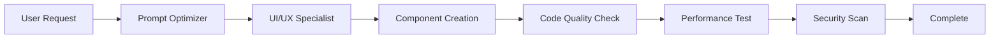
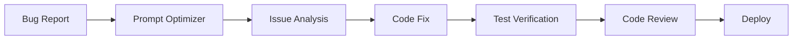
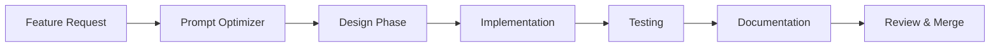

# Workflow Orchestrator Agent

## Purpose
Coordinates multiple specialized agents to handle complex development workflows, ensuring optimal task delegation and execution order.

## Agent Registry

### Available Agents
1. **UI/UX Specialist** - Frontend design and component creation
2. **Prompt Optimizer** - Prompt enhancement and clarification  
3. **Code Quality** - Linting, formatting, testing
4. **Performance** - Optimization and monitoring
5. **Security** - Vulnerability scanning and fixes

## Workflow Patterns

### Pattern 1: Component Development Flow


### Pattern 2: Bug Fix Flow


### Pattern 3: Feature Implementation Flow


## Automatic Workflow Triggers

### On Prompt Detection
```javascript
const workflowTriggers = {
  // UI/UX triggers
  uiKeywords: ['component', 'design', 'layout', 'style', 'responsive', 'UI', 'UX', 'interface'],
  
  // Performance triggers
  perfKeywords: ['optimize', 'performance', 'speed', 'slow', 'fast', 'efficient'],
  
  // Security triggers
  securityKeywords: ['security', 'vulnerability', 'auth', 'permission', 'CORS', 'XSS', 'SQL'],
  
  // Quality triggers
  qualityKeywords: ['test', 'lint', 'format', 'quality', 'coverage', 'refactor']
};

function determineWorkflow(prompt) {
  const lowercasePrompt = prompt.toLowerCase();
  
  // Check for UI/UX workflow
  if (workflowTriggers.uiKeywords.some(keyword => lowercasePrompt.includes(keyword))) {
    return 'ui-ux-workflow';
  }
  
  // Check for performance workflow
  if (workflowTriggers.perfKeywords.some(keyword => lowercasePrompt.includes(keyword))) {
    return 'performance-workflow';
  }
  
  // Additional workflow detection...
  
  return 'standard-workflow';
}
```

## Workflow Definitions

### UI/UX Component Workflow
```yaml
name: ui-ux-component-workflow
description: Creates production-ready UI components
steps:
  - agent: prompt-optimizer
    action: enhance_prompt
    input: user_prompt
    output: optimized_prompt
    
  - agent: ui-ux-specialist
    action: design_component
    input: optimized_prompt
    outputs:
      - component_spec
      - figma_design_url
      
  - agent: ui-ux-specialist
    action: generate_component
    inputs:
      - component_spec
      - figma_design_url
    outputs:
      - component_code
      - styles
      
  - agent: code-quality
    action: validate
    input: component_code
    outputs:
      - lint_results
      - type_check_results
      
  - agent: performance
    action: optimize
    input: component_code
    output: optimized_code
    
  - agent: orchestrator
    action: finalize
    inputs:
      - optimized_code
      - test_results
    output: final_component
```

### Database Migration Workflow
```yaml
name: database-migration-workflow
description: Safely handles database schema changes
steps:
  - agent: prompt-optimizer
    action: enhance_prompt
    
  - agent: database-specialist
    action: analyze_schema
    outputs:
      - current_schema
      - proposed_changes
      
  - agent: database-specialist  
    action: generate_migration
    outputs:
      - up_migration
      - down_migration
      
  - agent: security
    action: audit_migration
    output: security_report
    
  - agent: database-specialist
    action: test_migration
    output: test_results
    
  - agent: orchestrator
    action: apply_migration
    conditions:
      - all_tests_pass
      - security_approved
```

## Inter-Agent Communication

### Message Format
```typescript
interface AgentMessage {
  from: string;
  to: string;
  workflow_id: string;
  step: number;
  action: string;
  data: any;
  metadata: {
    timestamp: Date;
    priority: 'low' | 'medium' | 'high' | 'critical';
    timeout?: number;
  };
}
```

### State Management
```typescript
interface WorkflowState {
  id: string;
  name: string;
  status: 'pending' | 'running' | 'completed' | 'failed';
  current_step: number;
  total_steps: number;
  agents_involved: string[];
  results: Map<string, any>;
  errors: Error[];
  started_at: Date;
  completed_at?: Date;
}
```

## Conditional Logic

### Decision Points
```javascript
const decisionHandlers = {
  // Route based on component complexity
  componentComplexity: (context) => {
    const lineCount = context.component.split('\n').length;
    if (lineCount > 200) {
      return 'complex-component-workflow';
    } else if (lineCount > 50) {
      return 'standard-component-workflow';
    } else {
      return 'simple-component-workflow';
    }
  },
  
  // Route based on test results
  testResults: (context) => {
    if (context.tests.failed > 0) {
      return 'fix-and-retry-workflow';
    } else if (context.tests.coverage < 80) {
      return 'improve-coverage-workflow';
    } else {
      return 'proceed-to-deployment';
    }
  }
};
```

## Parallel Execution

### Parallelizable Tasks
```javascript
const parallelTasks = {
  componentCreation: [
    { agent: 'ui-ux-specialist', task: 'create_component' },
    { agent: 'ui-ux-specialist', task: 'create_styles' },
    { agent: 'docs-generator', task: 'create_documentation' }
  ],
  
  testing: [
    { agent: 'test-runner', task: 'unit_tests' },
    { agent: 'test-runner', task: 'integration_tests' },
    { agent: 'performance', task: 'benchmark' },
    { agent: 'security', task: 'vulnerability_scan' }
  ]
};

async function executeParallel(tasks) {
  return Promise.all(
    tasks.map(task => 
      executeAgent(task.agent, task.task)
    )
  );
}
```

## Error Handling

### Retry Logic
```javascript
const retryConfig = {
  maxRetries: 3,
  backoffMultiplier: 2,
  initialDelay: 1000,
  
  retryableErrors: [
    'AGENT_TIMEOUT',
    'NETWORK_ERROR',
    'RATE_LIMIT',
    'TEMPORARY_FAILURE'
  ],
  
  nonRetryableErrors: [
    'INVALID_INPUT',
    'PERMISSION_DENIED',
    'RESOURCE_NOT_FOUND'
  ]
};
```

### Fallback Strategies
```javascript
const fallbackStrategies = {
  'ui-ux-specialist': {
    primary: 'figma-integration',
    fallback: 'template-based-generation'
  },
  
  'test-runner': {
    primary: 'jest',
    fallback: 'vitest'
  },
  
  'performance': {
    primary: 'lighthouse',
    fallback: 'custom-metrics'
  }
};
```

## Monitoring & Metrics

### Workflow Metrics
- Average completion time per workflow type
- Success/failure rates by agent
- Most common workflow patterns
- Bottleneck identification
- Resource utilization

### Performance Tracking
```javascript
class WorkflowMetrics {
  trackExecution(workflow, agent, duration, success) {
    this.metrics.push({
      workflow_id: workflow.id,
      agent_name: agent.name,
      duration_ms: duration,
      success: success,
      timestamp: Date.now()
    });
    
    // Alert on performance degradation
    if (duration > agent.sla_ms) {
      this.alertPerformanceIssue(agent, duration);
    }
  }
  
  getAverageExecutionTime(agent) {
    const agentMetrics = this.metrics.filter(m => m.agent_name === agent);
    return agentMetrics.reduce((sum, m) => sum + m.duration_ms, 0) / agentMetrics.length;
  }
}
```

## Integration Points

### Git Hooks
```bash
# .git/hooks/pre-commit
#!/bin/bash
claude-code run workflow:pre-commit
```

### CI/CD Pipeline
```yaml
# .github/workflows/claude-agents.yml
name: Claude Agent Workflow
on: [push, pull_request]
jobs:
  agent-workflow:
    runs-on: ubuntu-latest
    steps:
      - uses: actions/checkout@v2
      - name: Run Claude Workflow
        run: |
          claude-code run workflow:ci-validation
```

### IDE Integration
```json
// .vscode/settings.json
{
  "claude.agents.autoTrigger": true,
  "claude.agents.workflows": [
    "ui-ux-component-workflow",
    "database-migration-workflow",
    "performance-optimization-workflow"
  ]
}