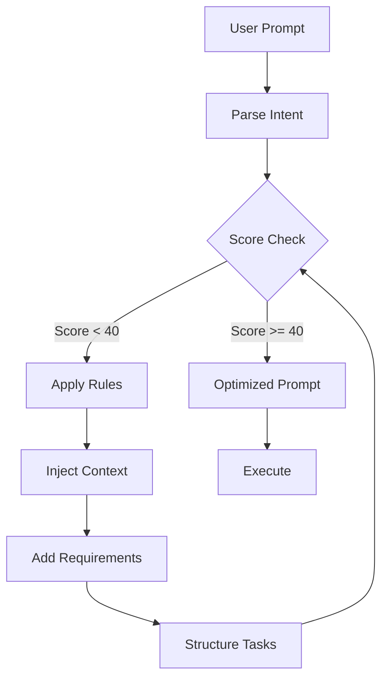

# Prompt Optimizer Rules

## Core Optimization Principles

### 1. Clarity First
- Replace ambiguous terms with specific technical terms
- Define measurable outcomes
- Include acceptance criteria

### 2. Context Enrichment
- Add file paths and locations
- Include technology stack details
- Reference existing patterns

### 3. Task Decomposition
- Break complex tasks into steps
- Order by dependency
- Identify parallelizable work

## Automatic Enhancements by Category

### UI/UX Prompts
**Trigger Keywords**: component, design, layout, UI, UX, interface, button, form, modal, card

**Auto-additions**:
- Metronic component library reference
- Tailwind CSS v4 utilities
- Responsive design requirements
- Accessibility standards (WCAG 2.1 AA)
- Dark mode support
- Loading states
- Error handling UI

### Backend/API Prompts  
**Trigger Keywords**: API, endpoint, route, database, query, migration, model

**Auto-additions**:
- RESTful conventions
- Authentication/authorization requirements
- Validation rules
- Error response formats
- OpenAPI documentation
- Rate limiting considerations
- CORS configuration

### Performance Prompts
**Trigger Keywords**: optimize, slow, performance, speed, fast, efficient, cache

**Auto-additions**:
- Current performance metrics
- Target benchmarks
- Profiling requirements
- Caching strategies
- Bundle optimization
- Lazy loading opportunities
- Core Web Vitals targets

### Testing Prompts
**Trigger Keywords**: test, spec, coverage, TDD, unit, integration, e2e

**Auto-additions**:
- Test framework (Jest/Vitest)
- Coverage targets (>80%)
- Mock requirements
- Edge cases to cover
- AAA pattern
- Snapshot testing where applicable

## Contextual Information Injection

### Project Context (Always Added)
```
Project: MaidCentral Booking Tool
Framework: Next.js 15.5.0
UI Library: React 19.1.0
Styling: Tailwind CSS v4
Component Library: Metronic v9
TypeScript: Strict mode enabled
Build Tool: Turbopack
```

### File Structure Context
```
/app - Next.js App Router
/app/components - Reusable components
/app/services - Business logic
/app/pages - Page components
/public - Static assets
/styles - Global styles
```

### Coding Conventions
```
- PascalCase for components
- camelCase for functions/variables
- TypeScript interfaces over types
- Functional components with hooks
- Named exports for components
- Default exports for pages
```

## Transformation Examples

### Example 1: Vague to Specific
**Input**: "Make a form"

**Output**: 
```
Create a form component at /app/components/Forms/BookingForm.tsx with:
- Service type dropdown (cleaning types from API)
- Date picker with availability checking
- Time slot selector (30-min intervals)
- Customer information fields (name, email, phone)
- Address autocomplete using Google Places
- Special instructions textarea
- Price calculation display
- Form validation using React Hook Form
- Submit to /api/bookings POST endpoint
- Loading state during submission
- Success/error message display
- Mobile-responsive layout
- Keyboard navigation support
```

### Example 2: Missing Context to Complete
**Input**: "Fix the bug"

**Output**:
```
Debug and resolve the issue by:
1. Check browser console for JavaScript errors
2. Review network tab for failed API requests
3. Inspect React Developer Tools for component state
4. Check server logs for backend errors
5. Verify environment variables are set
6. Test in different browsers
7. Document the root cause
8. Implement fix with error prevention
9. Add test to prevent regression
10. Update error handling for better UX
```

## Special Rules for MaidCentral

### Booking-Specific Enhancements
When prompt mentions booking, scheduling, or appointments:
- Add calendar integration requirements
- Include timezone handling
- Add conflict detection
- Include notification system
- Add cancellation/rescheduling logic

### Cleaning Service Context
When prompt relates to cleaning services:
- Reference service types (regular, deep, move-in/out)
- Include pricing calculation logic
- Add duration estimates
- Include supply requirements
- Add team assignment logic

### Customer Management
When prompt involves customers:
- Include data privacy requirements
- Add communication preferences
- Include payment method handling
- Add service history tracking
- Include loyalty/rewards logic

## Quality Metrics

### Prompt Scoring Rubric
- **Specificity** (0-10): How precise is the request?
- **Context** (0-10): How much relevant context included?
- **Actionability** (0-10): How clear are the steps?
- **Completeness** (0-10): Are all requirements defined?
- **Testability** (0-10): Can success be measured?

### Minimum Acceptable Scores
- All categories must score >= 7
- Total score must be >= 40
- If below threshold, iterate optimization

## Optimization Workflow



## Bypass Mechanisms

### Raw Mode
Prefix with `[raw]` to skip optimization:
```
[raw] Just add a button that says "Click me"
```

### Minimal Mode
Prefix with `[minimal]` for light optimization:
```
[minimal] Create a simple header component
```

### Expert Mode
Prefix with `[expert]` to assume all context known:
```
[expert] Implement OAuth2 PKCE flow
```